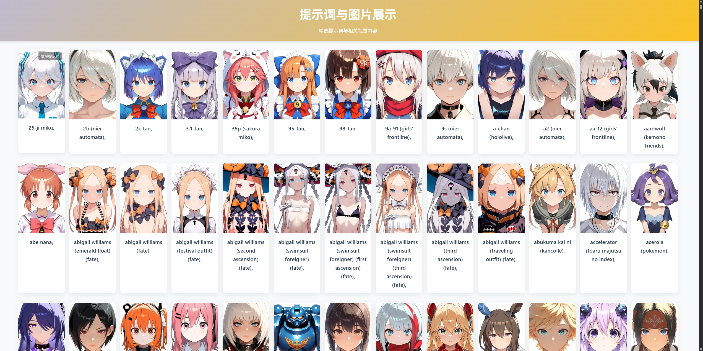

# 角色选择网页

该项目演示了如何在浏览器中从本地 JSON 文件加载角色和对应提示词，并展示角色图片，用于模型waiNSFWIllustrious文生图


## 项目结构

```
static/
├─ index.html          # 入口 HTML
├─ server.py           # 简易 Python HTTP 服务器
├─ pair.json           # 角色与提示词映射
├─ images/             # 角色图片
└─ README.md
```

## 快速开始

1. 确认已安装 Python 3（无需额外依赖）。
2. 在命令行中运行以下命令启动本地服务器（默认为 `8000` 端口）：

```bash
python static/server.py
```

3. 打开浏览器访问：

```
http://localhost:8000
```

即可看到角色选择页面，图片与提示词将通过 `fetch` 从 `pair.json` 加载。

## 可选配置

- 如果需要修改端口，可在 `static/server.py` 中调整 `PORT` 变量。
- 若需将项目部署到线上，只需将 `static` 目录内容托管到任意静态文件服务器或 CDN。

## 常见问题

- 直接双击 `index.html` 打开时，由于浏览器安全策略，`fetch` 无法读取本地文件，必须通过本地服务器访问。
- 图片无法显示：请确认 `images/` 目录中的文件名与 `pair.json` 中保持一致。

## License

MIT
# example
